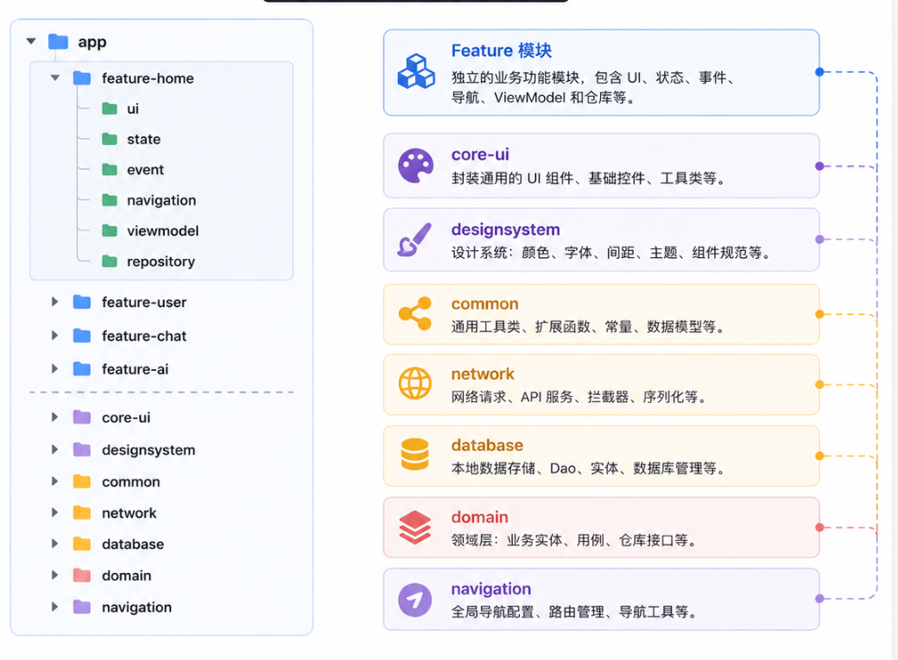

# 为什么你的 Compose 项目越来越难维护？

https://mp.weixin.qq.com/s/qMb_BWfK8jJz4Y798XxQbw

很多开发者刚开始接触 Jetpack Compose 时，都有一种感觉：**写 UI 真舒服。** 不用写 XML、不用 findViewById、不用 Adapter、不用 DataBinding，State 改变自动刷新 UI。一个页面几百行代码，很快就能写出来。于是很多团队开始全面迁移 Compose。然而半年以后，问题来了：一个 Screen 两三千行，一个 ViewModel 六七十个 State，composable 到处互相调用，StateFlow、SharedFlow、remember、rememberSaveable 混在一起，Navigation 参数越来越复杂，Preview 基本不能用，改一个按钮整个页面重新组合，新同事完全看不懂页面结构。很多人开始怀疑：Compose 是不是不适合大型项目？其实不是。**真正的问题不是 Compose，而是仍然沿用了 View 时代的开发方式。** Compose 只是 UI 技术，真正决定项目是否能够维护的，是你的架构。今天我们就聊聊：为什么 Compose 项目越来越难维护，以及大型项目应该如何拆分。

## Compose 最大的误区：认为它只是 UI

很多开发者理解 Compose：以前是 XML → View → Activity，现在变成 Composable → ViewModel，然后结束了。事实上，Compose 最大变化并不是 UI，而是**UI 成为了一个函数。** 例如：

```
@Composable
fun UserCard(user: User) { }
```

它本质就是`UI = f(State)`。UI 不再保存数据，不负责业务，不负责生命周期，只是 State 的一种映射。所以 Compose 最大思想其实就是：**状态驱动 UI（State Driven UI）。** 如果仍然把所有逻辑写进 Composable，Compose 很快就会变成新的 XML。

## 为什么大型 Compose 项目越来越乱？

来看一个真实项目。首页`HomeScreen.kt`刚开始只有 300 行，后来增加了 Banner、推荐、搜索、Tab、Feed、评论、点赞、收藏、广告、AI 推荐、BottomSheet、Dialog，最后暴涨到 3200 行。里面可能长这样：

```
Column {
    SearchBar()
    Banner()
    Category()
    LazyColumn { ... }
    BottomSheet()
    Dialog()
    Loading()
    Error()
}
```

然后继续堆叠无数`if (...) ...`，Composable 无限增长。很多团队认为 Compose 本来就是这样，其实真正原因只有一个：**没有组件拆分。**

## 第一个原则：Screen 不应该负责所有 UI

很多项目把所有组件、事件、State 全塞进一个 HomeScreen，最后变成 3000 行。正确做法是：

```
HomeScreen
├── SearchSection
├── BannerSection
├── RecommendSection
├── FeedSection
├── BottomBar
├── FloatingButton
└── Dialog
```

每个 Section 都是独立 composable，例如`BannerSection()`、`FeedSection()`、`SearchSection()`。这样即使页面复杂，每个 composable 也只有几十行，阅读体验完全不同。

## 第二个原则：State 不要全部放进一个 ViewModel

经常看到 ViewModel 里塞了几十个`MutableStateFlow`（banner, list, loading, dialog, user, city, weather, ai, history, message, search...），最后 ViewModel 超过 1000 行。实际上，不同模块应该拥有自己的 State：`HomeUiState`、`SearchUiState`、`FeedUiState`、`BannerUiState`、`UserUiState`。然后在 HomeScreen 中通过`collectAsState()`分发给不同 Section，每个模块完全独立。

## 第三个原则：Composable 只负责展示

典型错误：在`Button(onClick = { repository.login() })`里直接调仓库，在`LazyColumn { items(repository.load()) }`里直接加载数据，或者在`LaunchedEffect(Unit){ api.request() }`里发网络请求。Composable 不要请求网络、查询数据库、写业务逻辑、修改 Repository。正确的方向是：UI → Event → ViewModel → UseCase → Repository。Composable 永远只是展示数据。

## 第四个原则：把 UI 拆成 Design System

很多项目里，按钮、颜色（`Color(0xFF2196F3)`）、字体（`18.sp`）、间距（`16.dp`）到处复制粘贴，等需要全局改颜色时就开始痛苦搜索。真正大型项目都会建立`designsystem`模块，包含 Button、Card、Dialog、Loading、Avatar、Tag、SearchBar、Toolbar 等。页面里只写`PrimaryButton()`、`SearchBar()`、`AppToolbar()`，颜色和尺寸全部统一管理。

## 第五个原则：Feature 模块化

把全部页面扔在`app/ui`下，最终堆积 200 多个 composable，耦合严重。应该拆分为：`feature-home`、`feature-user`、`feature-login`、`feature-chat`、`feature-ai`、`feature-order`、`feature-pay`。每个 Feature 拥有自己的 ui、state、viewmodel、repository、navigation，完全独立，多人开发互不影响。

## 第六个原则：Navigation 不要污染业务

避免在各个 Composable 里直接调用`navController.navigate(...)`，让 UI 知道了所有页面和路由细节。应该抽象出`Navigator`接口，例如`interface HomeNavigator { fun openDetail(id: String) }`。Composable 不知道 Route、不知道 NavController，UI 更容易测试，业务也更干净。

## 第七个原则：事件统一管理

面对一堆 Button 里四处调用`viewModel.xxx()`，推荐使用`UiEvent`密封接口统一处理：

```
sealed interface HomeEvent {
    data object Refresh
    data class ClickItem(val id: String)
    data class Search(val keyword: String)
}
```

Composable 统一调用`onEvent(HomeEvent.Refresh)`，ViewModel 集中处理，新增事件不会污染代码。

## 第八个原则：UI State 必须唯一

同时存在`loading`、`isLoading`、`showLoading`、`refreshing`、`progress`，没人知道真正的加载状态是谁。推荐统一为一个不可变数据类：

```
data class HomeUiState(
    val loading: Boolean,
    val list: List<Article>,
    val error: String?
)
```

整个页面只有这一个 State，任何更新都通过`copy()`产生。Compose 最擅长处理不可变数据。

## 推荐的大型 Compose 项目结构

如果是企业项目，更推荐这种目录：



优势明显：职责清晰，每个 Feature 拥有完整闭环；可扩展，新增业务只加新模块；适合多人协作，减少冲突；便于测试，各层解耦后可分别单元测试和 UI 测试。

## Compose 的核心不是组件，而是数据流

很多人学 Compose 把重点放在`LazyColumn`、`Box`、`Modifier`、`remember`、`Animation`，这些都只是技术细节。真正决定项目质量的是数据流。健康的数据流路径：

```
User Action → UI Event → ViewModel → UseCase → Repository → Network/Database
                                                                     ↓
Recomposition ← Composable ← collectAsState() ← StateFlow
```

数据永远单向流动（UDF），状态来源唯一（SSOT）。这样不仅容易调试，也能避免各种状态同步问题。

## 写在最后

Compose 的出现让 Android UI 开发进入声明式时代，但**声明式 UI 并不等于声明式架构。** 真正让项目变得难维护的，从来不是 Compose，而是把所有职责都堆到一个 Screen、一个 ViewModel、一个状态对象里。当项目规模不断扩大时，应逐步建立以下核心原则：

-   Screen 负责组织，而不是承担所有 UI。
-   Composable 专注展示，不编写业务逻辑。
-   ViewModel 管理状态，而不是成为业务“大杂烩”。
-   通过 Feature 模块化隔离业务边界。
-   建立统一的 Design System，避免 UI 重复建设。
-   坚持单向数据流，让状态始终可预测。

如果说 XML 时代考验的是界面开发能力，那么 Compose 时代真正考验的，是**架构设计能力。** 未来的 Android 项目，竞争的不再是谁会写 Compose，而是谁能构建一个**可维护、可扩展、可协作** 的 Compose 工程体系。