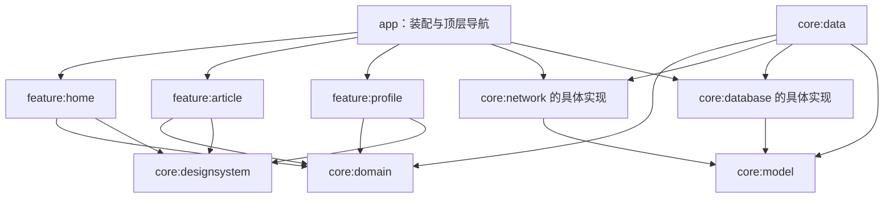
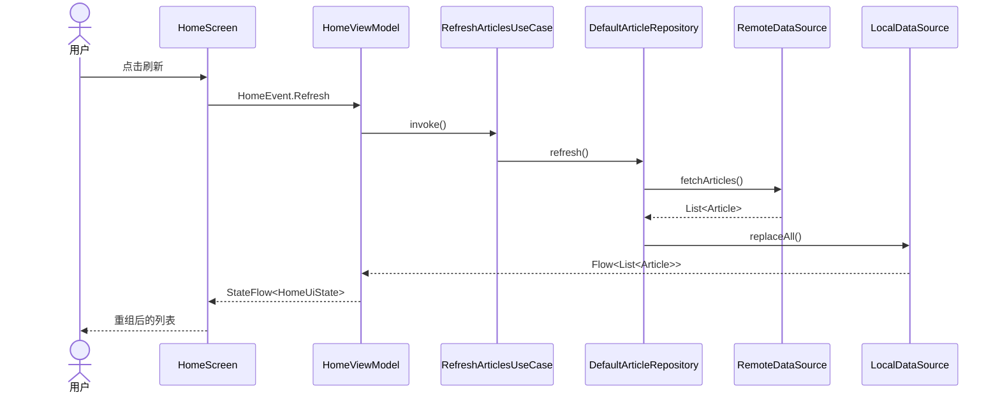

# Enterprise Compose Template 架构原则落实说明

本文说明本项目如何落实 [Compose 架构设计原则](./Compose架构设计原则.md) 中描述的设计思想。文中的代码片段均来自当前工程，重点不是展示某个 Compose API，而是说明职责边界、状态所有权和数据流为什么可维护。

## 1. 总体结论

原文的核心可以归纳为三句话：

1. UI 是状态的函数，Composable 只展示 State 并上报 Event。
2. 状态和数据沿单一方向流动，页面只有一个可信状态源。
3. 用 Section、Feature 和 Core 模块分别控制代码规模、业务边界和复用边界。

项目通过 11 个 Gradle 模块落实这些要求：



这里有两个关键约束：Feature 之间没有依赖；具体实现只在 `app` 的组合根中装配。新增业务不会继续向一个 `app/ui` 目录堆文件，也不需要修改其他 Feature 的内部实现。

## 2. 原则一：Screen 负责组织，而不是承担全部 UI

首页明确分成状态容器、页面组织和 Section 三层：

- `HomeRoute`：取得 ViewModel、生命周期安全地收集状态、消费一次性 Effect。
- `HomeScreen`：只根据状态选择 Loading、Error、Empty 或内容区域。
- `HomeSections`：提供搜索区、Feed 区、文章卡片和错误区。

`HomeScreen` 的核心只有页面编排：

```kotlin
@Composable
fun HomeScreen(state: HomeUiState, onEvent: (HomeEvent) -> Unit) {
    Scaffold(topBar = { /* AppToolbar */ }) { innerPadding ->
        Box(modifier = Modifier.fillMaxSize().padding(innerPadding)) {
            when {
                state.isLoading && state.articles.isEmpty() -> LoadingContent()
                state.errorMessage != null && state.articles.isEmpty() -> ErrorSection(...)
                state.showEmpty -> EmptyContent("没有匹配的内容")
                else -> HomeContent(...)
            }
        }
    }
}
```

而 `HomeContent` 继续把复杂区域交给 Section：

```kotlin
Column(...) {
    SearchSection(query = state.query, onQueryChanged = onQueryChanged)
    FeedSection(
        articles = state.articles,
        isRefreshing = state.isLoading,
        onArticleClick = onArticleClick,
        onRefresh = onRefresh,
    )
}
```

因此增加 Banner、推荐区或筛选区时，新增的是独立 Section，不会让 Screen 演变成数千行文件。Section 接收最小必要参数，也降低了无关状态变化引起的重组范围。

## 3. 原则二：State 不全部放进一个 ViewModel

项目没有全局“万能 ViewModel”。业务状态跟随 Feature 所有权分布：

| Feature | ViewModel | 唯一页面状态 |
| --- | --- | --- |
| 首页 | `HomeViewModel` | `HomeUiState` |
| 文章详情 | `ArticleViewModel` | `ArticleUiState` |
| 个人中心 | `ProfileViewModel` | `ProfileUiState` |

`MainActivity` 不持有上述业务状态，`EnterpriseApp` 也只持有顶层回退栈。首页 ViewModel 不管理用户资料，个人页 ViewModel 也不管理文章列表。这使状态的修改权限、生命周期和测试范围都与业务边界一致。

如果首页后续增长为 Banner、Feed、Search 三个可独立演进的复杂区域，可以继续在 `feature:home` 内引入子状态或子状态持有者；当前模板已经通过 `HomeUiState` 和 Section 参数提供这一演进路径，而无需把状态提升到应用全局。

## 4. 原则三：Composable 只负责展示

所有业务 Composable 都遵循 `State + Callback -> UI`。例如首页纯 Screen 的完整输入是：

```kotlin
@Composable
fun HomeScreen(
    state: HomeUiState,
    onEvent: (HomeEvent) -> Unit,
)
```

点击刷新时，UI 只发送事件：

```kotlin
onRefresh = { onEvent(HomeEvent.Refresh) }
```

Composable 中没有 Repository、DAO、网络请求或 UseCase 调用。真正的数据动作按以下路径执行：

```text
HomeScreen
  -> HomeEvent.Refresh
  -> HomeViewModel.refresh()
  -> RefreshArticlesUseCase
  -> ArticleRepository.refresh()
  -> ArticleRemoteDataSource + ArticleLocalDataSource
```

`Route` 与 `Screen` 分离也很重要。`HomeRoute` 是 Android 生命周期边界：

```kotlin
val state = viewModel.uiState.collectAsStateWithLifecycle().value
HomeScreen(state = state, onEvent = viewModel::onEvent)
```

因此 `HomeScreen` 不需要 ViewModel 就能 Preview 和 UI 测试；预览代码直接传入示例 `HomeUiState`，不会启动网络或数据库。

## 5. 原则四：把 UI 拆成 Design System

`core:designsystem` 集中定义三类资产：

- 主题：`EnterpriseTheme` 与亮/暗配色。
- 令牌：`AppSpacing`，统一 `extraSmall` 到 `extraLarge` 的间距语义。
- 组件：`AppToolbar`、`PrimaryButton`、`LoadingContent`、`EmptyContent`。

Feature 使用语义化令牌：

```kotlin
modifier = Modifier.padding(LocalAppSpacing.current.medium)
```

而不是在每个页面复制品牌颜色和任意间距。按钮也通过统一组件使用：

```kotlin
PrimaryButton(text = "重试", onClick = onRetry)
```

当品牌色、按钮规范或加载样式改变时，只修改 Design System，不需要在多个 Feature 全局搜索替换。

## 6. 原则五：Feature 模块化

本项目使用物理 Gradle 模块而不只是包名区分：

```text
feature/
├── home/       # 首页、搜索、Feed、HomeNavigator
├── article/    # 文章详情、ArticleNavigator
└── profile/    # 个人中心、ProfileNavigator
```

每个 Feature 拥有完整闭环：UiState、Event、Effect、ViewModel、Route、Screen 和导航契约。其 `build.gradle.kts` 只依赖领域、模型与设计系统，不依赖具体网络/数据库，也不依赖其他 Feature。

这种边界带来以下效果：

- 多团队可并行修改不同 Feature，减少热点文件冲突。
- Feature 能独立编译和测试。
- 删除某个业务时，依赖影响可由 Gradle 模块边界直接识别。
- 具体基础设施被替换时，Feature 的 UI 与事件契约保持不变。

`settings.gradle.kts` 显式列出所有模块，避免业务代码悄悄回流到 `app`。

## 7. 原则六：Navigation 不污染业务

Feature 不引用 `NavController`，不包含字符串 Route，也不知道其他 Feature 的 Screen。首页只声明业务导航意图：

```kotlin
interface HomeNavigator {
    fun openArticle(id: String)
    fun openProfile()
}
```

ViewModel 把点击转换为一次性 Effect：

```kotlin
is HomeEvent.ArticleClicked ->
    _effects.tryEmit(HomeEffect.OpenArticle(event.id))
```

Route 消费 Effect 并调用接口：

```kotlin
viewModel.effects.collect { effect ->
    when (effect) {
        is HomeEffect.OpenArticle -> navigator.openArticle(effect.id)
        HomeEffect.OpenProfile -> navigator.openProfile()
    }
}
```

最终只有 `app/EnterpriseApp.kt` 把导航意图映射成 `AppDestination`。模板当前使用轻量状态回退栈以减少基础示例依赖；未来替换为 Navigation Compose 时，只需更改 app 的导航宿主和 Navigator 实现，Feature Screen 与 ViewModel 无需知道路由格式。

## 8. 原则七：事件统一管理

每个页面使用密封接口表达用户能做什么。例如首页：

```kotlin
sealed interface HomeEvent {
    data object Refresh : HomeEvent
    data class QueryChanged(val query: String) : HomeEvent
    data class ArticleClicked(val id: String) : HomeEvent
    data object ProfileClicked : HomeEvent
}
```

Screen 只有一个 `onEvent` 出口，ViewModel 只有一个 `onEvent` 入口。与散落的 `viewModel.refresh()`、`viewModel.search()`、`viewModel.open()` 相比，这种方式形成了可枚举的页面协议：代码审查时能快速看到全部交互，日志和埋点也可以在统一入口增加。

项目还把两类信息分开：

- `UiState`：可重放的页面事实，例如列表、加载、错误。
- `Effect`：只消费一次的行为，例如打开页面、返回。

导航不进入 UiState，因此设备旋转或重新收集 StateFlow 不会重复跳转。

## 9. 原则八：UI State 必须唯一

首页只有一个公开状态流：

```kotlin
private val _uiState = MutableStateFlow(HomeUiState())
val uiState = _uiState.asStateFlow()
```

状态模型是不可变数据类：

```kotlin
data class HomeUiState(
    val isLoading: Boolean = true,
    val query: String = "",
    val articles: List<Article> = emptyList(),
    val errorMessage: String? = null,
) {
    val showEmpty: Boolean
        get() = !isLoading && errorMessage == null && articles.isEmpty()
}
```

外部无法取得 `MutableStateFlow`，所有更新都在 ViewModel 内通过 `copy()` 或完整新快照产生。`showEmpty` 从已有事实推导，不再增加一个可能与列表状态冲突的 `MutableStateFlow<Boolean>`。

三个 Feature 分别拥有自己的唯一 UiState；“唯一”指每个页面/业务边界内的单一真相源，而不是把整个应用重新塞回一个巨型状态对象。

## 10. 单向数据流与单一数据源

一次首页刷新经历完整闭环：



Repository 的实现采用“本地为读取真相源”策略：

```kotlin
override fun observeArticles(): Flow<List<Article>> = local.observeArticles()

override suspend fun refresh(): Result<Unit> = withContext(dispatchers.io) {
    runCatching { local.replaceAll(remote.fetchArticles()) }
}
```

网络只负责更新本地，UI 不同时观察“网络列表”和“缓存列表”，因此不会出现两套数据互相覆盖的竞争状态。这就是数据层的 SSOT；页面的 `HomeUiState` 则是 UI 层的 SSOT。

## 11. ViewModel 管状态，UseCase 管规则

ViewModel 负责生命周期内的状态协调和事件分发，但搜索规则没有直接写在 ViewModel。`ObserveArticlesUseCase` 封装标题、摘要、分类的过滤规则：

```kotlin
repository.observeArticles().map { articles ->
    if (query.trim().isEmpty()) articles
    else articles.filter { article ->
        article.title.contains(query, ignoreCase = true) ||
            article.summary.contains(query, ignoreCase = true) ||
            article.category.contains(query, ignoreCase = true)
    }
}
```

因此相同规则可以被其他入口复用，并可脱离 Android UI 做快速单元测试。模板中的 `ObserveArticlesUseCaseTest` 已覆盖标题/摘要/分类过滤，`HomeUiStateTest` 验证空态推导，分别体现领域规则测试和状态测试。

## 12. 依赖注入与可替换边界

`AppContainer` 是唯一组合根：

```kotlin
private val articleRepository = DefaultArticleRepository(
    remote = FakeArticleRemoteDataSource(),
    local = InMemoryArticleLocalDataSource(),
    dispatchers = DefaultDispatcherProvider,
)
```

Feature 通过构造器接收 UseCase，Repository 通过构造器接收数据源。模板没有强制团队选择某个 DI、网络或数据库框架：

- 把 Fake Remote 换成 Retrofit/Ktor 实现，不改变 Repository 接口。
- 把内存 Local 换成 Room 实现，不改变 UseCase 或 Feature。
- 把手工 `AppContainer` 换成 Hilt/Koin，只改变绑定方式。

这种“先有清晰依赖边界，再选择框架”的做法，避免架构被某个库的 API 反向定义。

## 13. 可测试性与可预览性

架构拆分直接提供测试接缝：

- 纯 Screen：传入任意 UiState 和空事件函数即可 Preview/UI 测试。
- UiState：普通 Kotlin 数据类，可直接测试派生属性。
- UseCase：传入 Fake Repository，可用协程测试验证业务规则。
- Repository：可分别替换 Fake Remote 和 Fake Local 验证同步策略。
- Navigator：测试中可传入记录调用的 Fake Navigator。

当前工程验证命令：

```bash
./gradlew test
./gradlew :app:assembleDebug
```

## 14. 模板刻意保留的扩展点

这是企业项目模板而不是特定公司的成品业务应用，因此以下部分被设计为可替换边界：

| 当前模板实现 | 生产环境常见替换 | 不受影响的部分 |
| --- | --- | --- |
| `FakeArticleRemoteDataSource` | Retrofit/Ktor + DTO 映射 | Feature、UseCase、领域层 Repository 契约 |
| `InMemoryArticleLocalDataSource` | Room/DataStore | Feature、UseCase |
| `AppContainer` | Hilt/Koin | 构造器依赖与业务边界 |
| 状态列表导航 | Navigation Compose | Screen、ViewModel、Navigator 契约 |
| 示例文章模型 | 企业领域模型 | 模块分层和数据流方式 |

实际落地时还应按组织要求补充鉴权、网络安全配置、日志脱敏、可观测性、数据库迁移、CI、截图测试和基线性能检测。这些属于企业基础设施治理，不应该被塞入某个 Composable 或巨型 ViewModel。

## 15. 与原文原则的最终映射

| 原文原则 | 工程证据 |
| --- | --- |
| Screen 不负责所有 UI | `HomeScreen` 组织状态分支，`HomeSections` 拆分搜索、Feed、Card、Error |
| State 不全放进一个 ViewModel | Home、Article、Profile 各自拥有 ViewModel 和 UiState，无全局业务 ViewModel |
| Composable 只负责展示 | Screen 仅接收 UiState 与 Event 回调；Route 负责生命周期收集 |
| UI 拆成 Design System | 独立 `core:designsystem`，统一主题、间距和基础组件 |
| Feature 模块化 | `feature:home`、`feature:article`、`feature:profile` 为独立 Gradle 模块 |
| Navigation 不污染业务 | Feature 声明 Navigator，路由和回退栈仅存在于 app |
| 事件统一管理 | 每个页面使用密封 Event；一次性导航使用独立 Effect |
| UI State 必须唯一 | 每页一个只读 StateFlow 和不可变 UiState，派生状态不重复存储 |
| UDF / SSOT | Event 向下、State 向上；Repository 实现始终从 Local Flow 对 UI 提供数据 |

综上，本项目不是把原文原则停留在目录命名层面，而是通过 Gradle 依赖边界、构造器依赖、不可变状态、统一事件入口、Navigator 契约以及可运行的数据闭环把原则变成了可由编译器和测试共同约束的工程结构。
